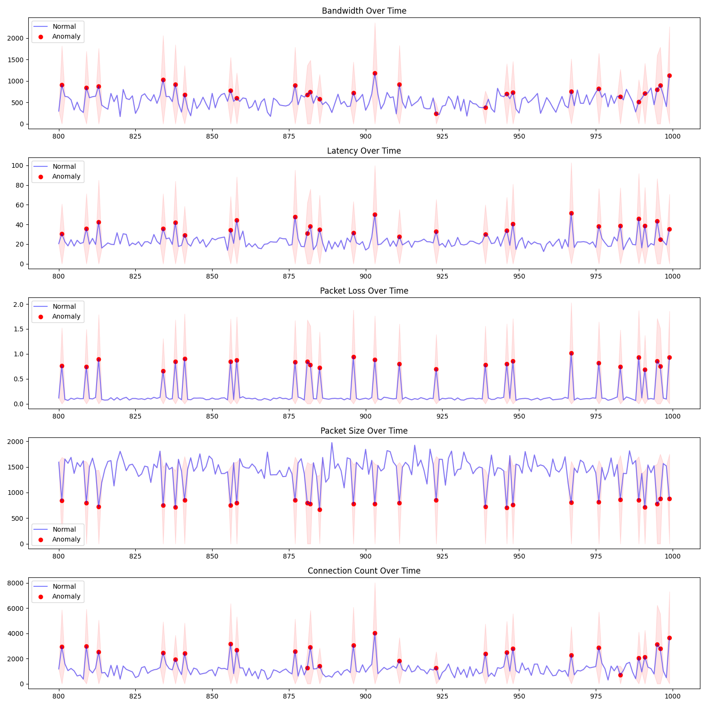

# Network Performance Analytics System

## Overview
An intelligent network monitoring system that combines deep learning with traditional machine learning to detect, predict, and analyze network connectivity issues. Originally motivated by inconsistent T-Mobile home internet performance in Lewisburg, PA, this project evolved into a comprehensive solution for network performance monitoring and analysis.

## Key Features
- Real-time network performance monitoring and anomaly detection
- Environmental correlation analysis (weather impacts on network performance)
- Predictive maintenance alerts using LSTM neural networks
- Comprehensive visualization of network metrics and patterns
- Router log analysis and system resource monitoring

## Technical Implementation
- **Deep Learning**: PyTorch-based LSTM model with attention mechanism
- **Traditional ML**: Isolation Forest for statistical anomaly detection
- **Data Processing**: Real-time metric collection using psutil and speedtest-cli
- **Environmental Integration**: OpenWeather API for weather correlation
- **Visualization**: Interactive dashboards using matplotlib and seaborn

## Core Components
1. **Network Monitoring**
   - Bandwidth tracking
   - Latency measurement
   - Packet loss detection
   - Connection stability analysis
   - System resource utilization

2. **Machine Learning Pipeline**
   - LSTM-based sequence analysis
   - Attention mechanism for temporal patterns
   - Hybrid model approach (deep learning + traditional ML)
   - Real-time prediction capabilities

3. **Environmental Analysis**
   - Weather condition correlation
   - Time-based pattern recognition
   - Router log parsing
   - System event tracking

4. **Visualization & Reporting**
   - Real-time performance dashboards
   - Anomaly visualization
   - Historical trend analysis
   - Environmental impact reports

## Technologies Used
- Python 3.x
- PyTorch
- scikit-learn
- pandas/numpy
- matplotlib/seaborn
- OpenWeather API
- psutil/speedtest-cli
- ping3

## Impact
- Reduced network issue diagnosis time from hours to minutes
- Enabled proactive maintenance through predictive analytics
- Provided data-driven insights for network optimization
- Created a foundation for community-based network performance monitoring

## Future Development
- Web dashboard implementation
- Mobile app for real-time alerts
- Community data aggregation
- Machine learning model optimization

## Project Background & Personal Motivation

Living in Lewisburg with my family and relying on T-Mobile home internet, we frequently experienced frustrating connectivity issues, particularly during crucial moments like watching football games. These random disconnections and performance drops led me to wonder: Could we predict these issues before they happen? Is there a pattern to when our connection gets worse?

This personal experience inspired me to develop a system that could:
1. Monitor our home network performance
2. Detect patterns in connection degradation
3. Potentially predict issues before they impact our streaming
4. Understand if there are specific times or conditions when issues are more likely

## Potential Extensions

1. Home Network Monitoring:
- Deploy on a Raspberry Pi as a home network monitor
- Create mobile app notifications for predicted issues
- Generate weekly reports of network health

2. Smart Home Integration:
- Correlate network issues with:
  * Time of day/week
  * Weather conditions
  * Number of connected devices
  * Streaming service usage (Netflix, sports streaming)
  * Gaming sessions

3. Community Features:
- Aggregate anonymized data from multiple T-Mobile home internet users
- Compare performance across different areas
- Identify regional patterns or issues
- Share optimization tips based on collected data

4. ISP Communication:
- Generate detailed reports for T-Mobile support
- Provide evidence of systematic issues
- Help identify optimal router placement
- Suggest best times for high-bandwidth activities

## Future Vision

This project could evolve into a community-driven tool helping others with similar issues:
- Share experiences and solutions
- Identify common patterns across different locations
- Provide data-driven feedback to ISPs
- Help optimize home network setups

The goal is to transform a frustrating personal experience into a solution that could help other families dealing with similar connectivity challenges.

## Technical Details

The system combines two powerful machine learning approaches:

### Deep Learning Component
- Custom autoencoder architecture that learns the "normal" pattern of network behavior
- Neural network classifier that explicitly identifies anomalous patterns
- Benefits from both supervised and unsupervised learning techniques

### Traditional ML Component
- Isolation Forest implementation for statistical anomaly detection
- Provides a different perspective on what constitutes "abnormal" behavior
- Acts as a validation mechanism for the deep learning predictions
